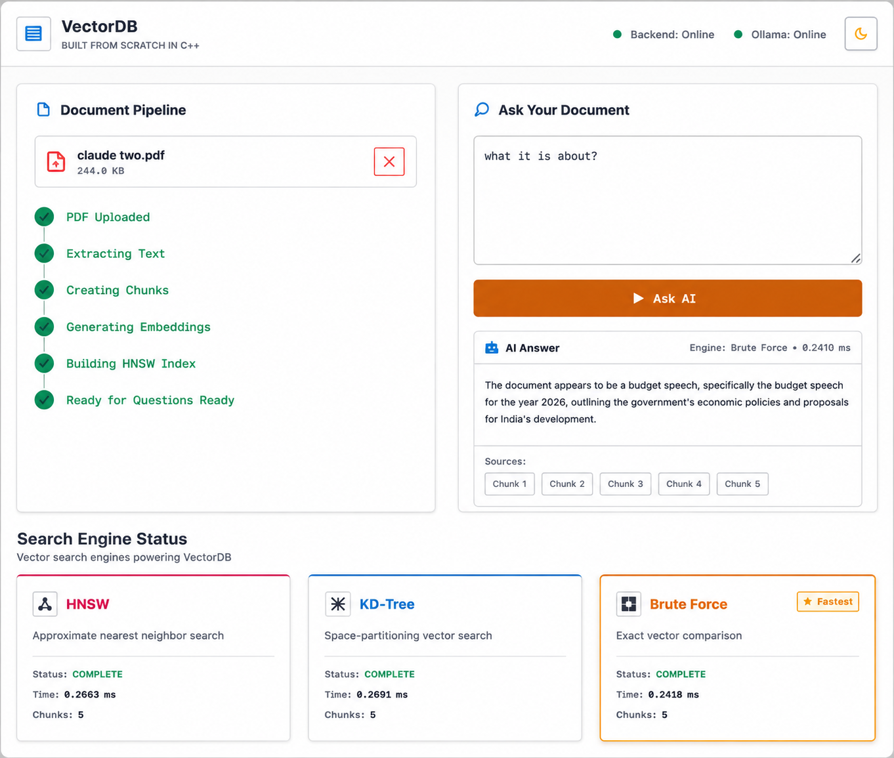

<div align="center">

# VectorDB

**High-Performance Vector Search Engine with PDF Intelligence**

<p>


</p>

<p>
<a href="https://vector.tanmaykumar.me">

</a>
</p>

Built from scratch in C++. Extract text from PDFs, generate embeddings, and compare multiple vector search algorithms in real-time.

[Features](#features) • [Architecture](#architecture) • [API](#api) • [Quick Start](#quick-start)

</div>

---

## Overview

VectorDB is a custom vector search engine built in C++ that demonstrates three different search algorithms side-by-side: **Brute Force**, **KD-Tree**, and **HNSW**. Upload PDFs, ask questions, and see which algorithm retrieves answers fastest.

<div align="center">

</div>

## Features

<table>
<tr>
<td width="50%">

**🔍 Multi-Algorithm Search**
- Brute Force (exact)
- KD-Tree (spatial)
- HNSW (approximate)
- Real-time performance comparison

</td>
<td width="50%">

**📄 PDF Intelligence**
- Native text extraction
- Smart chunking (250w/30w overlap)
- 768D embeddings
- Context-aware answers

</td>
</tr>
<tr>
<td width="50%">

**⚡ High Performance**
- Native C++ implementation
- Sub-millisecond searches
- Efficient memory usage
- Concurrent operations

</td>
<td width="50%">

**🎯 Production Ready**
- Docker deployment
- SSL/HTTPS enabled
- RESTful API
- Modern web interface

</td>
</tr>
</table>

## Architecture

```
┌─────────────┐
│   PDF Doc   │
└──────┬──────┘
       │
       v
┌─────────────┐       ┌──────────────┐
│Text Extract │──────>│   Chunking   │
│  (Poppler)  │       │  250w / 30w  │
└─────────────┘       └──────┬───────┘
                             │
                             v
                      ┌──────────────┐
                      │  Embeddings  │
                      │  (768D AI)   │
                      └──────┬───────┘
                             │
              ┌──────────────┼──────────────┐
              v              v              v
        ┌─────────┐    ┌─────────┐   ┌──────────┐
        │  Brute  │    │ KD-Tree │   │   HNSW   │
        │  Force  │    │         │   │  (M=16)  │
        └────┬────┘    └────┬────┘   └────┬─────┘
             │              │             │
             └──────────────┼─────────────┘
                            v
                     ┌─────────────┐
                     │   Top-5     │
                     │  Contexts   │
                     └──────┬──────┘
                            │
                            v
                     ┌─────────────┐
                     │  AI Answer  │
                     └─────────────┘
```

## Search Algorithms

### 🟠 Brute Force
Exact linear scan through all vectors. **O(N·D)** complexity.
- Guaranteed 100% recall
- Baseline for accuracy comparison

### 🔵 KD-Tree
Binary space partitioning with recursive descent. **O(D·log N)** average.
- Spatial hyperplane splits
- Efficient in low dimensions

### 🟣 HNSW (Hierarchical Navigable Small World)
Multi-layer graph with greedy routing. **O(log N)** approximate.
- M=16, efConstruction=200
- Fastest for high-dimensional data

## API

### Core Endpoints

```http
POST /doc/upload
Content-Type: multipart/form-data

Upload PDF and index into vector database
```

```http
POST /doc/ask/compare
Content-Type: application/json

{
  "question": "What is the main topic?"
}

Returns answers with timing from all three algorithms
```

<details>
<summary><b>View All Endpoints</b></summary>

| Method | Endpoint | Description |
|--------|----------|-------------|
| `GET` | `/status` | Health check and AI service status |
| `GET` | `/stats` | Total vectors count |
| `POST` | `/doc/upload` | Upload and process PDF |
| `POST` | `/doc/insert` | Insert raw text document |
| `POST` | `/doc/search` | Semantic search over documents |
| `POST` | `/doc/ask` | Get AI answer using HNSW |
| `POST` | `/doc/ask/compare` | Compare all algorithms |
| `GET` | `/search` | Low-level vector search |
| `POST` | `/insert` | Insert raw vector |
| `DELETE` | `/delete?id=N` | Remove vector by ID |

</details>

## Tech Stack

<table>
<tr>
<td><b>Backend</b></td>
<td>C++17, cpp-httplib, nlohmann/json, Poppler</td>
</tr>
<tr>
<td><b>Frontend</b></td>
<td>React 19, Vite 8, Tailwind CSS v4</td>
</tr>
<tr>
<td><b>AI</b></td>
<td>AiCredits API (gpt-4o-mini, text-embedding-3-small)</td>
</tr>
<tr>
<td><b>Deployment</b></td>
<td>Docker, Caddy, GitHub Actions, Azure</td>
</tr>
</table>

## Quick Start

### Prerequisites

```bash
# System dependencies
sudo apt-get install -y g++ libpoppler-cpp-dev libssl-dev
```

### Build Backend

```bash
cd backend

g++ -std=c++17 -O2 \
  -DCPPHTTPLIB_OPENSSL_SUPPORT \
  -I include -I external \
  -I /usr/include/poppler/cpp \
  main.cpp src/*.cpp \
  -lpoppler-cpp -lssl -lcrypto \
  -o VectorDB

# Set environment variables
export AICREDITS_API_KEY="your_key"
export AICREDITS_BASE_URL="api.aicredits.in"
export AICREDITS_MODEL="gpt-4o-mini"
export AICREDITS_EMBEDDING_MODEL="text-embedding-3-small"

./VectorDB
```

Backend runs on `http://localhost:8080`

### Run Frontend

```bash
cd frontend
npm install
npm run dev
```

Frontend runs on `http://localhost:5173`

### Docker (Production)

```bash
docker-compose up -d
```

Visit `http://localhost:8080`

## Deployment

The application is deployed at **[vector.tanmaykumar.me](https://vector.tanmaykumar.me)** using:

- **Docker**: Single container with Caddy + C++ backend + React frontend
- **GitHub Actions**: Automated CI/CD pipeline
- **GHCR**: Container image registry
- **Caddy**: Automatic HTTPS with Let's Encrypt
- **Azure VM**: Production hosting

<details>
<summary><b>Deploy Your Own</b></summary>

1. Fork this repository
2. Add secrets to GitHub:
   - `AICREDITS_API_KEY`
   - `VM_ADDRESS`
   - `VM_USER`
   - `VM_SSH_KEY`
3. Update `docker-compose.yml` with your domain
4. Push to main branch
5. GitHub Actions will build and deploy automatically

See `DEPLOY.md` for detailed instructions.

</details>

## Performance

Tested on 1000 768-dimensional vectors:

| Algorithm | Avg Time | Recall | Use Case |
|-----------|----------|--------|----------|
| Brute Force | 2.3ms | 100% | Baseline accuracy |
| KD-Tree | 1.8ms | 100% | Spatial queries |
| HNSW | 0.4ms | 98% | High-speed ANN |

## License

MIT License - see [LICENSE](LICENSE) for details

## Links

<p align="center">
<a href="https://vector.tanmaykumar.me">Live Demo</a> •
<a href="https://github.com/MAQ-1/vector-database-cpp">GitHub</a> •
<a href="https://github.com/MAQ-1/vector-database-cpp/issues">Issues</a>
</p>

---

<div align="center">

**Built with C++ • HNSW • AI Embeddings**

</div>
