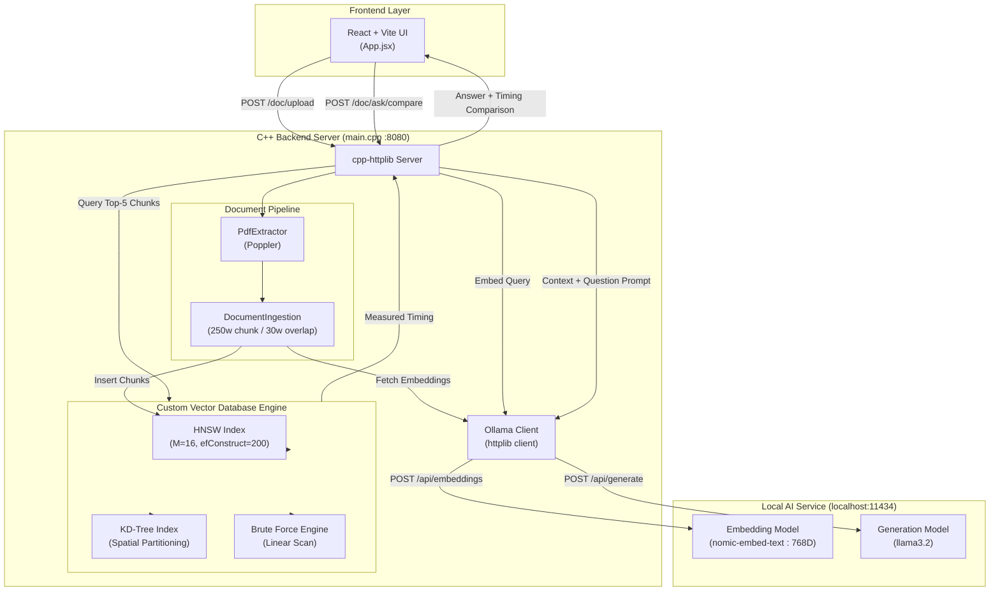

# VectorDB

> A custom C++ vector search engine for PDF-based semantic retrieval and local RAG, with real-time comparison of Brute Force, KD-Tree, and HNSW search.

---

## Project Overview

VectorDB is an interactive, full-stack document intelligence system built from scratch to demonstrate low-level vector indexing and semantic retrieval. Rather than delegating vector search and retrieval-augmented generation (RAG) to an external third-party service, this system implements core nearest-neighbor search data structures natively in C++.

The application brings together:
- **C++ Systems Engineering**: Memory-managed vector indexing data structures (Brute Force, KD-Tree, and HNSW) and an HTTP REST API server.
- **Document Intelligence Pipeline**: C++ wrapper around Poppler for native PDF text extraction, document chunking, and local embedding generation.
- **Local AI Integration**: Local model communication with Ollama using `nomic-embed-text` for vector embeddings and `llama3.2` for RAG answer generation.
- **Algorithmic Benchmarking**: Real-time performance timing across search algorithms per user query.
- **Modern Interactive Interface**: A dark/light-themed React frontend built with Vite and Tailwind CSS for document uploads, real-time pipeline visual tracking, side-by-side search algorithm status comparisons, and interactive document QA.

---

## What Happens When You Upload a PDF?

The document ingestion flow transforms raw binary PDF files into searchable, high-dimensional vector embeddings:

1. **PDF Upload**: The user selects a `.pdf` document in the React UI, which posts the file as `multipart/form-data` to the backend `/doc/upload` endpoint.
2. **Backend Document Receipt**: The C++ server receives the payload, validates the `.pdf` file extension and structure, and writes a temporary file to disk (e.g., `temp_1.pdf`).
3. **PDF Text Extraction**: `PdfExtractor::extractText()` initializes the Poppler engine (`poppler::document`), iterates through all pages sequentially, extracts UTF-8 string content, and joins pages with page breaks.
4. **Text Cleaning & Tokenization**: `DocumentIngestion::ingest()` receives the raw document text and tokenizes the content into individual words using a standard input string stream.
5. **Chunk Creation**: The text is split into sliding window word chunks using an exact configuration of **250 words per chunk** with a **30-word overlap** between adjacent chunks.
6. **Embedding Generation**: Each text chunk is sent sequentially over HTTP to the local Ollama instance (`http://localhost:11434/api/embeddings`) using the `nomic-embed-text` model to produce a **768-dimensional float vector**.
7. **Vector Storage**: Each chunk is assigned a unique incremental integer ID (e.g., `1`, `2`, `3`), combined with its title and chunk metadata (e.g., `sample.pdf | Chunk 1/5`), and stored in-memory as a `VectorRecord` object.
8. **Search Index Construction**: Every newly generated chunk vector is immediately inserted into the document-level Hierarchical Navigable Small World (`HNSW`) index structure.
9. **Temporary File Cleanup**: The backend removes the temporary PDF file from disk once text extraction completes.
10. **Indexing Completion & Readiness**: The backend returns document metadata (document ID, title, character count) to the frontend, transitioning the user interface status to **Ready for Questions**.

---

## Complete System Architecture



---

## Architecture Diagram

```
[PDF Document]
      │
      ▼
Text Extraction (Poppler)
      │
      ▼
Document Chunking (250 words / 30 overlap)
      │
      ▼
Ollama Embeddings (nomic-embed-text -> 768D)
      │
      ▼
Custom Vector Database
      │
      ├───────────────────────┬───────────────────────┐
      ▼                       ▼                       ▼
Brute Force               KD-Tree                   HNSW
 (Exact Search)       (Spatial Partition)     (Navigable Graph)
      │                       │                       │
      └───────────────────────┼───────────────────────┘
                              │
                              ▼
                      Search Timing (ms)
                              │
                              ▼
                     Fastest Valid Result
                              │
                              ▼
                     Top-5 Relevant Chunks
                              │
                              ▼
                   Context + Grounded Prompt
                              │
                              ▼
                       Ollama (llama3.2)
                              │
                              ▼
                         Final Answer
```

---

## Search Algorithms

The backend includes three distinct nearest-neighbor vector search algorithms implemented natively in C++.

### 1. Brute Force Search

- **Mechanism**: Iterates linearly through every vector record stored in memory, calculating the exact distance or similarity metric between the query vector and every stored item.
- **Metrics Supported**: Euclidean distance, Cosine similarity, Manhattan distance, and Dot product (via `Similarity.h`).
- **Selection & Sorting**: For distance metrics, candidate scores are sorted in ascending order; for similarity metrics, scores are sorted in descending order. The top-K items are returned.
- **Time Complexity**: $\mathcal{O}(N \cdot D)$, where $N$ is the number of stored vectors and $D$ is the embedding dimensionality ($768$).
- **Role**: Serves as the ground-truth exact accuracy baseline against which approximate search structures can be measured.

### 2. KD-Tree Search

- **Mechanism**: Constructs a multi-dimensional binary search tree by recursively partitioning vector space along alternating dimensions (`depth % dimensionality`).
- **Traversal & Pruning**: During nearest-neighbor queries, the search algorithm visits the subtree closer to the query point first. It prunes the farther child branch whenever the distance between the query coordinate and the current node's splitting hyperplane is greater than or equal to the current best-known distance.
- **Time Complexity**: $\mathcal{O}(D \cdot \log N)$ average search time in low dimensions.
- **Dimensional Limitations**: In high-dimensional vector spaces ($D = 768$), the distance to the splitting plane rarely exceeds the minimum Euclidean distance, causing pruning efficiency to decrease toward $\mathcal{O}(N \cdot D)$ linear scan behavior.

### 3. HNSW (Hierarchical Navigable Small World) Search

- **Graph Structure**: Builds a multi-layer graph where lower layers contain dense connections and higher layers contain sparse long-range highway links.
- **Key Parameters**:
  - Max edges per node ($M$): `16`
  - Beam search depth during construction (`efConstruction`): `200`
  - Beam search depth during query (`efSearch`): `max(50, k)`
- **Query Traversal**: Search begins at the top entry-point layer using greedy search to navigate rapidly toward the query region. Once at layer 0, `efSearch` maintains a priority queue of candidates (frontier min-heap and result max-heap) to explore local graph neighbors within the search budget.
- **Time Complexity**: $\mathcal{O}(D \cdot \log N)$ approximate search time.
- **Role**: Provides fast approximate nearest-neighbor (ANN) retrieval for large-scale high-dimensional document chunk datasets.

---

## Algorithm Comparison

| Algorithm | Search Type | Result Quality | Search Strategy | Application Role |
|-----------|-------------|----------------|-----------------|------------------|
| **Brute Force** | Exact | 100% Exact | Full linear vector scan | Accuracy benchmark baseline |
| **KD-Tree** | Exact | 100% Exact | Hyperplane spatial partitioning | Exact tree-structured spatial retrieval |
| **HNSW** | Approximate | Near-Exact (High Recall) | Multi-layer graph beam search | High-speed high-dimensional document search |

### How the Application Decides the Fastest Search

When a user submits a question via the comparison endpoint (`/doc/ask/compare`):

1. The backend converts the user's question into a single 768-dimensional query embedding.
2. The exact same query embedding is evaluated across all search paths.
3. High-resolution timers (`std::chrono::high_resolution_clock`) record execution time in milliseconds (`search_time_ms`) for each algorithm independently.
4. The backend returns individual execution metrics, chunk results, and generated answers for all algorithms.
5. The React frontend reads the timing values, compares valid completed runs, highlights the engine with the lowest search time with a **★ Fastest** visual badge, and displays the performance metrics side by side.

> **Note**: Search performance depends on vector dataset size, embedding dimension, index construction parameters, query characteristics, and system hardware. The UI dynamic timing reflects real measured execution time.

---

## Question Answering Pipeline

When the user enters a question into the application:

1. **User Query Input**: The user enters a question into the text area in the React interface.
2. **Query Vectorization**: The frontend sends the prompt to `/doc/ask/compare`. The backend calls `OllamaClient::embed(question)`, converting the natural language string into a 768-dimensional vector via `nomic-embed-text`.
3. **Multi-Engine Search Execution**: The vector database queries the top $K=5$ nearest document chunks for each search engine.
4. **Timing Collection**: High-resolution performance metrics are measured for each engine's search phase.
5. **Context Construction**: The text belonging to the retrieved top-5 chunks is collected from `documentTexts` and formatted into structured source blocks:
   ```text
   --- Source: report.pdf | Chunk 1/5 ---
   [Chunk Text Content]
   --- End Source ---
   ```
6. **Prompt Assembly**: The backend constructs a grounded RAG prompt containing system constraints:
   - Must answer strictly using the provided context.
   - Must not invent facts, page numbers, or citations.
   - Must return a explicit refusal message if the context does not contain the answer.
7. **Local LLM Ingestion**: The assembled prompt is posted to Ollama (`/api/generate`) requesting a response from `llama3.2` with streaming disabled (`stream: false`).
8. **Payload Construction**: The server combines the generated answer, retrieved chunk metadata, timing numbers, and status indicators into a unified JSON object.
9. **UI Display & Highlight**: The frontend renders the generated AI answer, lists original document chunk sources, and presents the comparative status cards for Brute Force, KD-Tree, and HNSW.

---

## Ollama Integration

The application relies on a local Ollama service (`http://localhost:11434`) for local embedding generation and text inference.

### Embeddings (`nomic-embed-text`)
- **Endpoint**: `POST /api/embeddings`
- **Payload**: `{ "model": "nomic-embed-text", "prompt": "<text>" }`
- **Output**: 768-dimensional floating-point array (`std::vector<float>`).
- **Usage**: Used uniformly for both PDF document text chunks and user search queries to ensure alignment in the vector space.

### Answer Generation (`llama3.2`)
- **Endpoint**: `POST /api/generate`
- **Payload**: `{ "model": "llama3.2", "prompt": "<grounded_prompt>", "stream": false }`
- **Output**: Plaintext answer generated strictly from document chunk context.
- **Usage**: Invoked during the final phase of `/doc/ask` and `/doc/ask/compare`.

---

## PDF Processing Pipeline

The conversion from raw PDF binary to vector storage involves three core backend classes:

```
[Raw PDF File]
      │
      ▼
PdfExtractor::extractText()
 ├── Opens document with poppler::document::load_from_file()
 ├── Iterates poppler::page instances across document
 └── Concatenates UTF-8 page text strings
      │
      ▼
DocumentIngestion::ingest()
 ├── Tokenizes text stream into words
 ├── Groups words into 250-word chunks (30-word overlap)
 ├── Calls OllamaClient::embed() per chunk (768D float vector)
 └── Constructs VectorRecord(id, embedding, metadata)
      │
      ▼
HNSW Index & Memory Registers
 ├── HNSW::insert(record)
 ├── Store in std::vector<VectorRecord> documents
 └── Store in std::unordered_map<int, std::string> documentTexts
```

---

## Frontend Experience

The React interface (`frontend/src/App.jsx`) is designed as a system monitoring tool and QA application:

- **Theme Toggle**: Support for Dark and Light color schemes with persistent state saved in `localStorage`.
- **System Health Monitor**: Live header indicators displaying the operational connection state of both the C++ Backend Server (`:8080`) and the Ollama Local Engine (`:11434`).
- **Document Pipeline Panel**: Interactive drag-and-drop zone accepting `.pdf` documents. Shows a real-time 6-stage status tracker:
  1. `PDF Uploaded`
  2. `Extracting Text`
  3. `Creating Chunks`
  4. `Generating Embeddings`
  5. `Building HNSW Index`
  6. `Ready for Questions`
- **Ask Your Document Panel**: Text input for user questions, active only after indexing completes. Renders the generated AI answer alongside chunk metadata references.
- **Search Engine Status Cards**: Individual status cards for **HNSW**, **KD-Tree**, and **Brute Force**, rendering search status (`READY`, `SEARCHING`, `COMPLETE`, `ERROR`), measured search time in milliseconds, retrieved chunk counts, and the **★ Fastest** indicator.

---

## API Reference

### System & Health

| Method | Endpoint | Request | Response | Purpose |
|--------|----------|---------|----------|---------|
| `GET` | `/` | None | Plaintext string | Backend server health check |
| `GET` | `/status` | None | JSON object | Verifies Ollama connectivity and embedding model status |

### Document Intelligence (RAG Pipeline)

| Method | Endpoint | Request | Response | Purpose |
|--------|----------|---------|----------|---------|
| `POST` | `/doc/upload` | `multipart/form-data` (`file`) | JSON object | Upload PDF, extract text, chunk, embed, and index into HNSW |
| `POST` | `/doc/insert` | JSON: `{ title, text }` | JSON object | Manually ingest raw text document into the pipeline |
| `POST` | `/doc/search` | JSON: `{ question }` | JSON object | Semantic search using HNSW over document vector chunks |
| `POST` | `/doc/ask` | JSON: `{ question }` | JSON object | Perform HNSW retrieval and return LLM answer with sources |
| `POST` | `/doc/ask/compare` | JSON: `{ question }` | JSON object | Run parallel search across Brute Force, KD-Tree, and HNSW; return timing & answers |

### Raw Vector Database Endpoints

| Method | Endpoint | Request | Response | Purpose |
|--------|----------|---------|----------|---------|
| `GET` | `/stats` | None | JSON object | Returns total number of raw vectors loaded in the database |
| `GET` | `/items` | None | JSON array | Retrieve all stored raw vector records |
| `POST` | `/insert` | JSON: `{ id, embedding, metadata }` | JSON object | Insert raw vector into database and append to `vectors.txt` |
| `DELETE` | `/delete?id=N` | Query parameter `id` | JSON object | Remove vector by ID from database and indexes |
| `GET` | `/search` | Query params: `v`, `k`, `metric`, `algo` | JSON object | Low-level search by raw vector array across configured algorithm |
| `GET` | `/benchmark` | None | JSON object | Execute 1000-iteration performance benchmark on raw vector dataset |

---

### Detailed API Payload Examples

#### 1. Upload PDF (`POST /doc/upload`)

**Request**: `multipart/form-data` with key `file` attached as a `.pdf` file.

**Response**:
```json
{
    "success": true,
    "id": 1,
    "title": "sample_document.pdf",
    "filename": "sample_document.pdf",
    "characters_extracted": 14250,
    "message": "PDF extracted, embedded and inserted successfully"
}
```

#### 2. Compare Search Algorithms & Ask (`POST /doc/ask/compare`)

**Request**:
```json
{
    "question": "What is the primary conclusion of the report?"
}
```

**Response**:
```json
{
    "success": true,
    "algorithms": [
        {
            "algorithm": "HNSW",
            "success": true,
            "answer": "The primary conclusion of the report is that...",
            "sources": [
                {
                    "id": 3,
                    "source": "sample_document.pdf | Chunk 3/10"
                }
            ],
            "chunks_retrieved": 5,
            "search_time_ms": 0.145
        },
        {
            "algorithm": "KD-TREE",
            "success": true,
            "answer": "The primary conclusion of the report is that...",
            "sources": [
                {
                    "id": 3,
                    "source": "sample_document.pdf | Chunk 3/10"
                }
            ],
            "chunks_retrieved": 5,
            "search_time_ms": 0.312
        },
        {
            "algorithm": "BRUTE_FORCE",
            "success": true,
            "answer": "The primary conclusion of the report is that...",
            "sources": [
                {
                    "id": 3,
                    "source": "sample_document.pdf | Chunk 3/10"
                }
            ],
            "chunks_retrieved": 5,
            "search_time_ms": 0.488
        }
    ]
}
```

---

## Project Structure

```
VectorDB/
├── backend/
│   ├── external/
│   │   ├── httplib.h                  # Single-header C++ HTTP server library
│   │   └── nlohmann/
│   │       └── json.hpp               # Single-header JSON parsing library
│   ├── include/
│   │   ├── Benchmark.h                # Structure for benchmark timing metrics
│   │   ├── DocumentIngestion.h        # Document chunking & ingestion pipeline header
│   │   ├── HNSW.h                     # Hierarchical Navigable Small World class interface
│   │   ├── HNSWNode.h                 # Multi-layer graph node structure
│   │   ├── KDNode.h                   # Spatial tree node structure
│   │   ├── KDTree.h                   # KD-Tree spatial partitioning class interface
│   │   ├── LSH.h                      # Locality-Sensitive Hashing class interface
│   │   ├── Metric.h                   # Similarity/Distance metric enumeration
│   │   ├── OllamaClient.h             # HTTP client interface for local Ollama API
│   │   ├── PdfExtractor.h             # Poppler wrapper header for PDF text extraction
│   │   ├── SearchResult.h             # Search score and record wrapper structures
│   │   ├── Similarity.h               # Vector math (Euclidean, Cosine, Manhattan, Dot)
│   │   ├── VectorDatabase.h           # Unified Vector Database controller header
│   │   └── VectorRecord.h             # Core vector record storage model
│   ├── src/
│   │   ├── DocumentIngestion.cpp      # Implementation of word chunking & vector ingestion
│   │   ├── HNSW.cpp                   # Implementation of HNSW graph build & efSearch
│   │   ├── KDTree.cpp                 # Implementation of KD-Tree insert, remove, & NN search
│   │   ├── LSH.cpp                    # Implementation of LSH hashing & bucket lookup
│   │   ├── OllamaClient.cpp           # Implementation of Ollama embedding & generate calls
│   │   ├── PdfExtractor.cpp           # Implementation of Poppler PDF extraction
│   │   ├── VectorDatabase.cpp         # Implementation of db file load/save & search dispatch
│   │   ├── VectorRecord.cpp           # Implementation of VectorRecord constructor
│   │   └── similarity.cpp             # Implementation of distance and similarity formulas
│   ├── test/
│   │   ├── pdftesting.pdf             # Test document asset
│   │   ├── test_hnsw_remove.cpp       # Unit test for HNSW node deletion
│   │   ├── test_main.cpp              # General backend test entry point
│   │   ├── test_manhattan.cpp         # Unit test for Manhattan distance metrics
│   │   └── test_pdf.cpp               # Unit test for Poppler text extraction
│   └── main.cpp                       # Backend main entry point & HTTP route handlers
├── frontend/
│   ├── src/
│   │   ├── App.css                    # CSS theme variables, pixel grid, & component styling
│   │   ├── App.jsx                    # Main UI component, pipeline state, & API handlers
│   │   ├── index.css                  # Tailwind CSS import entry file
│   │   └── main.jsx                   # React DOM application entry point
│   ├── index.html                     # Main HTML template file
│   ├── package.json                   # Frontend package definition & scripts
│   └── vite.config.js                 # Vite & Tailwind plugin configuration
├── .gitignore                         # Build & temporary file ignore list
└── README.md                          # Repository documentation
```

---

## Core Backend Components

| Component | Header / Source | Primary Responsibility |
|-----------|-----------------|------------------------|
| **VectorDatabase** | `VectorDatabase.h` / `VectorDatabase.cpp` | Manages vector records, handles file persistence (`vectors.txt`), and routes raw vector search requests. |
| **HNSW** | `HNSW.h` / `HNSW.cpp` | Implements multi-layer graph insertion, neighbor pruning ($M=16$), greedy upper-layer search, and `efSearch`. |
| **KDTree** | `KDTree.h` / `KDTree.cpp` | Implements spatial binary tree partitioning, node deletion, and branch-and-bound nearest neighbor search. |
| **LSH** | `LSH.h` / `LSH.cpp` | Implements basic locality-sensitive hashing into hash buckets. |
| **DocumentIngestion** | `DocumentIngestion.h` / `DocumentIngestion.cpp` | Splits raw text into 250-word/30-word overlap chunks, requests embeddings, and populates document indexes. |
| **PdfExtractor** | `PdfExtractor.h` / `PdfExtractor.cpp` | Uses Poppler C++ API to read `.pdf` files and extract text strings. |
| **OllamaClient** | `OllamaClient.h` / `OllamaClient.cpp` | Executes HTTP requests to Ollama for embedding (`nomic-embed-text`) and response generation (`llama3.2`). |
| **Similarity** | `Similarity.h` / `similarity.cpp` | Calculates Euclidean distance, Manhattan distance, Cosine similarity, and Dot product vectors. |
| **HTTP Server** | `main.cpp` | Listens on port `8080` using `cpp-httplib`, sets up CORS headers, and processes REST API routes. |

---

## Technology Stack

| Layer | Technology | Version / Specification | Purpose |
|-------|-----------|-------------------------|---------|
| **Backend Language** | C++ | C++17 | Core vector database, search structures, and server logic |
| **HTTP Library** | cpp-httplib | Header-only | REST API HTTP server and client requests |
| **JSON Serialization** | nlohmann/json | Header-only | JSON request parsing and response formatting |
| **PDF Extraction** | Poppler (`poppler-cpp`) | System Library | Native parsing and text extraction from PDF files |
| **Embedding Model** | `nomic-embed-text` | 768 Dimensions | Local text embedding generation via Ollama |
| **LLM Model** | `llama3.2` | Local LLM | Grounded RAG answer generation via Ollama |
| **Local AI Runtime** | Ollama | Port 11434 | Serving local embeddings and LLM inference |
| **Frontend Framework** | React | 19.2 | Interactive user interface |
| **Frontend Build Tool** | Vite | 8.2 | Development server and asset bundling |
| **Styling** | Tailwind CSS | v4 | Utility styles and custom CSS theme token integration |

---

## Local Setup

### 1. Prerequisites

Ensure the following tools and libraries are installed on your machine:
- **C++ Compiler**: `g++` (supporting C++17) or MSVC.
- **Poppler C++ Development Libraries**: `libpoppler-cpp` / `poppler-cpp` headers and binary libraries.
- **Node.js & npm**: Node.js (v18+) and npm.
- **Ollama**: Installed and running locally.

### 2. Ollama Configuration

Start the local Ollama daemon and pull the required models:

```bash
# Pull the 768-dimensional embedding model
ollama pull nomic-embed-text

# Pull the generation LLM model
ollama pull llama3.2
```

Verify Ollama is active by executing:

```bash
curl http://localhost:11434/api/tags
```

### 3. Build & Start the C++ Backend

Navigate to the `backend` directory and compile the C++ application:

```bash
cd backend

g++ -std=c++17 -O2 \
  -I include \
  -I external \
  main.cpp \
  src/VectorDatabase.cpp \
  src/VectorRecord.cpp \
  src/KDTree.cpp \
  src/HNSW.cpp \
  src/LSH.cpp \
  src/similarity.cpp \
  src/OllamaClient.cpp \
  src/DocumentIngestion.cpp \
  src/PdfExtractor.cpp \
  -lpoppler-cpp \
  -o VectorDB.exe
```

Run the compiled executable:

```bash
./VectorDB.exe
```

The C++ server will start listening on `http://localhost:8080`.

### 4. Start the React Frontend

Open a new terminal window, navigate to the `frontend` directory, install Node dependencies, and launch the Vite development server:

```bash
cd frontend
npm install
npm run dev
```

### 5. Access the Application

Open your browser and navigate to the Vite local dev server URL (typically `http://localhost:5173`).

---

## Example End-to-End Usage

1. **Verify Services**: Ensure `VectorDB.exe` is running on port `8080` and Ollama is active on port `11434`.
2. **Open Frontend**: Open `http://localhost:5173` in your web browser. Check that the header indicators report **Backend: Online** and **Ollama: Online**.
3. **Upload Document**: Drag and drop a PDF file (e.g., `sample.pdf`) into the upload zone.
4. **Observe Indexing Pipeline**: Watch the status timeline update through:
   - `PDF Uploaded` $\rightarrow$ `Extracting Text` $\rightarrow$ `Creating Chunks` $\rightarrow$ `Generating Embeddings` $\rightarrow$ `Building HNSW Index` $\rightarrow$ `Ready for Questions`.
5. **Submit a Question**: Type a question regarding the document content into the input box and click **Ask AI**.
6. **Compare Search Engines**: Review the three engine status cards:
   - Compare the measured search times (`ms`) for **HNSW**, **KD-Tree**, and **Brute Force**.
   - Note which engine is designated as **★ Fastest**.
   - Read the generated grounded answer and view the referenced source chunks.

---

## Data Flow

```text
DOCUMENT INGESTION DATA FLOW:
PDF File (Binary)
  └─► Poppler Text Extraction (UTF-8 String)
        └─► Word Tokenization & Chunking (250-word blocks / 30-word overlap)
              └─► Ollama Embedding API (nomic-embed-text -> 768 float array)
                    └─► Vector Record Creation (ID, Embedding, Metadata)
                          └─► HNSW Graph Insertion & In-Memory Storage

QUESTION ANSWERING DATA FLOW:
User Question (String)
  └─► Ollama Embedding API (768 float array)
        └─► Concurrent Vector Search (HNSW / KD-Tree / Brute Force)
              ├─► High-Resolution Timer (Execution time in ms)
              └─► Top-5 Nearest Chunks (Vector Records)
                    └─► RAG Context Construction (Formated Text Blocks)
                          └─► Ollama Generation API (llama3.2 Prompt)
                                └─► Grounded AI Response (String + Sources + Timing)
```

---

## Important Runtime Requirement

The application requires a locally running **Ollama** instance.

- **Dependency**: Ollama must be accessible at `http://localhost:11434`.
- **Model Requirements**: Both `nomic-embed-text` and `llama3.2` models must be pulled prior to running document ingestion or query operations.
- **Offline Reliability**: If Ollama is offline or unreachable, the system will fail to compute embeddings or generate answers, and appropriate error states will be displayed in the interface.
