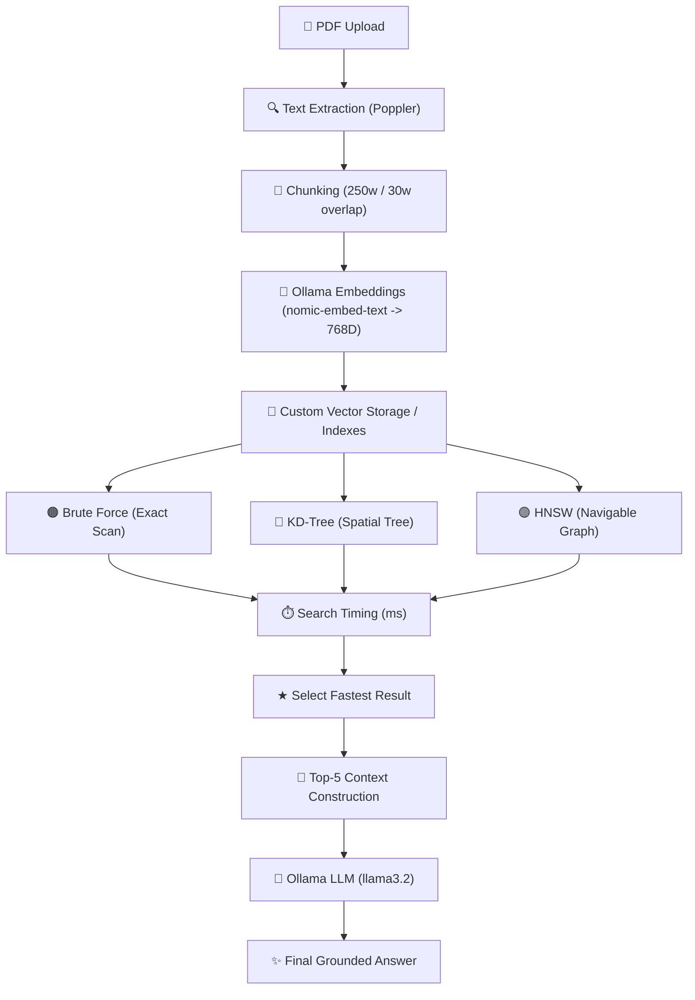
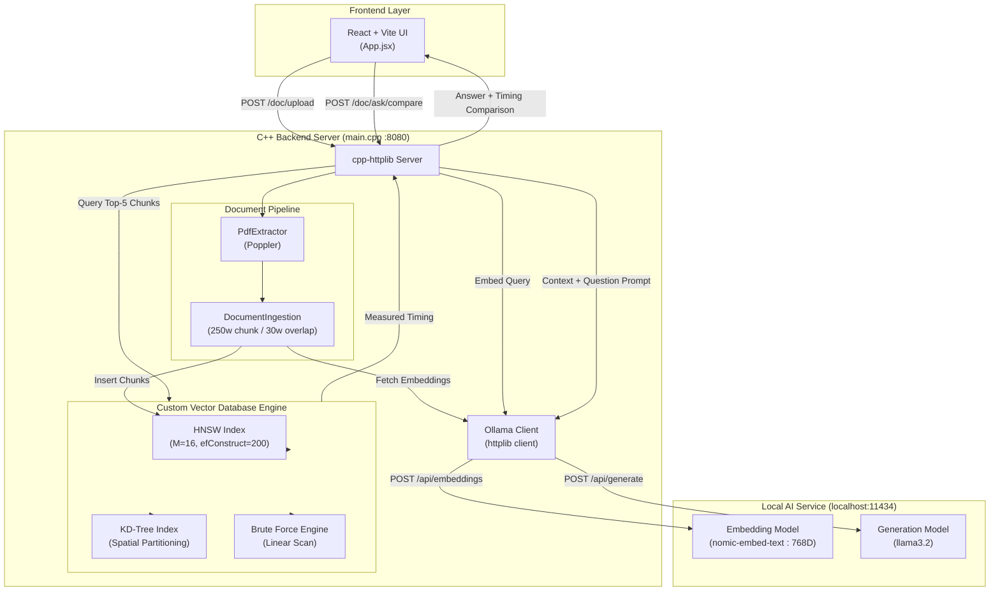

# VectorDB

> A custom C++ vector search engine for PDF-based semantic retrieval and local RAG.

<p align="center">
  An interactive document intelligence platform built from scratch in C++.<br/>
  Extract text from PDFs, generate 768D local embeddings via Ollama, and compare Brute Force, KD-Tree, and HNSW search in real time.
</p>

<p align="center">
  
  
  
  
  
</p>

---

## 🖥️ Project Interface

<div align="center">
  
</div>

<br />

> Interactive web interface for document ingestion, semantic search, AI-powered document queries, and real-time comparison of vector search algorithms.

---

## ⚡ Why VectorDB?

| 🧠 Custom Retrieval | ⚡ Multi-Algorithm Search | 📄 Document Intelligence | 🤖 100% Local AI |
|---|---|---|---|
| Built natively in C++ without third-party vector database frameworks | Real-time performance race across Brute Force, KD-Tree, and HNSW | Native PDF text extraction (Poppler) with 250-word sliding window chunking | Powered by local Ollama embeddings (`nomic-embed-text`) & LLM (`llama3.2`) |

---

## 🏗️ How It Works



---

## ✨ Core Features

| Feature | Description |
|---|---|
| 📄 **PDF Ingestion** | Native C++ PDF parsing via Poppler for clean multi-page UTF-8 text extraction |
| 🧩 **Smart Chunking** | Word-level sliding window segmentation (250 words per chunk with 30-word overlap) |
| 🧠 **Vector Embeddings** | Converts document chunks into 768-dimensional float vectors using local `nomic-embed-text` |
| 🔍 **Multi-Algorithm Search** | Implements Brute Force, KD-Tree spatial partitioning, and HNSW multi-layer graph search natively |
| ⏱️ **Real-Time Timing** | Measured search time per query in milliseconds using `std::chrono::high_resolution_clock` |
| 🤖 **Local RAG** | Generates grounded answers via `llama3.2` using top-retrieved document context without external APIs |

---

## 🔎 Search Engine Comparison

| Algorithm | Type | Search Style | Application Role |
|---|---|---|---|
| **Brute Force** | Exact | Full linear vector scan | Accuracy benchmark baseline |
| **KD-Tree** | Exact | Spatial hyperplane partitioning | Structured spatial tree retrieval |
| **HNSW** | Approximate | Multi-layer graph beam search | High-speed high-dimensional ANN search |

<br/>

<details>
<summary><b>🟠 Brute Force Search Details</b></summary>

<br/>

- **Algorithm Mechanism**: Scans every stored vector sequentially, computing distance or similarity metrics (Euclidean, Cosine, Manhattan, Dot Product via `Similarity.h`).
- **Time Complexity**: $\mathcal{O}(N \cdot D)$, where $N$ is vector count and $D=768$.
- **Purpose**: Guarantees 100% recall as a baseline to verify approximate index accuracy.

</details>

<details>
<summary><b>🔵 KD-Tree Search Details</b></summary>

<br/>

- **Algorithm Mechanism**: Constructs a binary spatial tree splitting vector space along `depth % dimension`. Recursively traverses nodes and prunes child branches when distance to the splitting plane exceeds best distance.
- **Time Complexity**: $\mathcal{O}(D \cdot \log N)$ average in low dimensions; approaches $\mathcal{O}(N \cdot D)$ in high-dimensional spaces ($D=768$) due to boundary distance collapse.

</details>

<details>
<summary><b>🟣 HNSW Search Details</b></summary>

<br/>

- **Algorithm Mechanism**: Builds a multi-layer graph ($M=16$, $efConstruction=200$). Greedy routing descends from upper highway layers; layer 0 uses `efSearch` beam search ($efSearch=\max(50, k)$) to find nearest neighbors within a priority queue budget.
- **Time Complexity**: $\mathcal{O}(D \cdot \log N)$ approximate search time.

</details>

---

## ⏱️ Runtime Search Comparison

When a user asks a question, the application executes a real-time retrieval race across all search algorithms:

1. The question is converted into a 768-dimensional embedding via `nomic-embed-text`.
2. The embedding is passed concurrently to Brute Force, KD-Tree, and HNSW routines.
3. Search duration (`search_time_ms`) is recorded using `std::chrono::high_resolution_clock`.
4. The UI displays performance metrics side by side and marks the engine with the lowest execution time with a **★ Fastest** badge.

> [!IMPORTANT]
> The fastest search algorithm is determined dynamically at runtime based on actual measured search time. Performance varies based on dataset size, vector dimensionality, query parameters, and hardware.

---

## 📄 From PDF to Searchable Knowledge

```text
1. Upload PDF
       ↓
2. Extract Text (Poppler)
       ↓
3. Create Document Chunks (250w / 30w overlap)
       ↓
4. Generate Embeddings (nomic-embed-text)
       ↓
5. Build Vector Indexes (HNSW / KD-Tree)
       ↓
6. Ready for Semantic Search & RAG
```

---

## 🛠️ Complete System Architecture



---

## 📡 API Reference

### Document Intelligence (RAG Pipeline)

| Method | Endpoint | Request Payload | Response Summary | Purpose |
|--------|----------|-----------------|------------------|---------|
| `POST` | `/doc/upload` | `multipart/form-data` (`file`) | `{ success, id, title, characters_extracted }` | Upload PDF, extract text, chunk, embed, and index into HNSW |
| `POST` | `/doc/insert` | `{ title, text }` | `{ success, id, title }` | Manually ingest raw text document into the pipeline |
| `POST` | `/doc/search` | `{ question }` | `{ success, id, metadata }` | Semantic search using HNSW over document vector chunks |
| `POST` | `/doc/ask` | `{ question }` | `{ success, answer, sources, chunks_retrieved }` | Perform HNSW retrieval and return LLM answer with sources |
| `POST` | `/doc/ask/compare` | `{ question }` | `{ success, algorithms: [...] }` | Run parallel search across Brute Force, KD-Tree, and HNSW; return timing & answers |

<details>
<summary><b>View Raw Vector DB & System Endpoints</b></summary>

<br/>

| Method | Endpoint | Request | Purpose |
|--------|----------|---------|---------|
| `GET` | `/` | None | Backend server health check |
| `GET` | `/status` | None | Verifies Ollama connectivity and embedding model status |
| `GET` | `/stats` | None | Returns total number of raw vectors loaded in the database |
| `GET` | `/items` | None | Retrieve all stored raw vector records |
| `POST` | `/insert` | `{ id, embedding, metadata }` | Insert raw vector into database and append to `vectors.txt` |
| `DELETE` | `/delete?id=N` | `?id=N` | Remove vector by ID from database and indexes |
| `GET` | `/search` | `?v=...&k=N&metric=...&algo=...` | Low-level search by raw vector array across configured algorithm |
| `GET` | `/benchmark` | None | Execute 1000-iteration performance benchmark on raw vector dataset |

</details>

---

## 💻 Tech Stack & Requirements

| Layer | Technology | Purpose |
|-------|-----------|---------|
| **Backend Language** | C++17 | Core vector database, search structures, and server logic |
| **HTTP Server** | `cpp-httplib` | Header-only REST API server & client |
| **JSON Parser** | `nlohmann/json` | Header-only JSON serialization |
| **PDF Parser** | Poppler (`poppler-cpp`) | Native parsing and text extraction from PDF files |
| **Embedding Model** | `nomic-embed-text` | 768-dimensional local embeddings via Ollama |
| **LLM Model** | `llama3.2` | Local RAG answer generation via Ollama |
| **Local AI Service** | Ollama (`:11434`) | Local model runtime for embeddings & inference |
| **Frontend Framework**| React 19 + Vite 8 | Interactive user interface and fast bundling |
| **Styling** | Tailwind CSS v4 | Dark/Light themed responsive interface |

---

## 🚀 Quick Start Guide

### 1. Ollama Configuration

Start Ollama and pull the required models:

```bash
ollama pull nomic-embed-text
ollama pull llama3.2
```

### 2. Build & Run C++ Backend

```bash
cd backend

g++ -std=c++17 -O2 \
  -I include \
  -I external \
  main.cpp \
  src/VectorDatabase.cpp \
  src/VectorRecord.cpp \
  src/KDTree.cpp \
  src/HNSW.cpp \
  src/LSH.cpp \
  src/similarity.cpp \
  src/OllamaClient.cpp \
  src/DocumentIngestion.cpp \
  src/PdfExtractor.cpp \
  -lpoppler-cpp \
  -o VectorDB.exe

./VectorDB.exe
```

The C++ server will listen on `http://localhost:8080`.

### 3. Start React Frontend

```bash
cd frontend
npm install
npm run dev
```

Open `http://localhost:5173` in your browser.

---

## 📌 Runtime Requirement

The application requires a locally running **Ollama** service on `http://localhost:11434` with `nomic-embed-text` and `llama3.2` installed.
